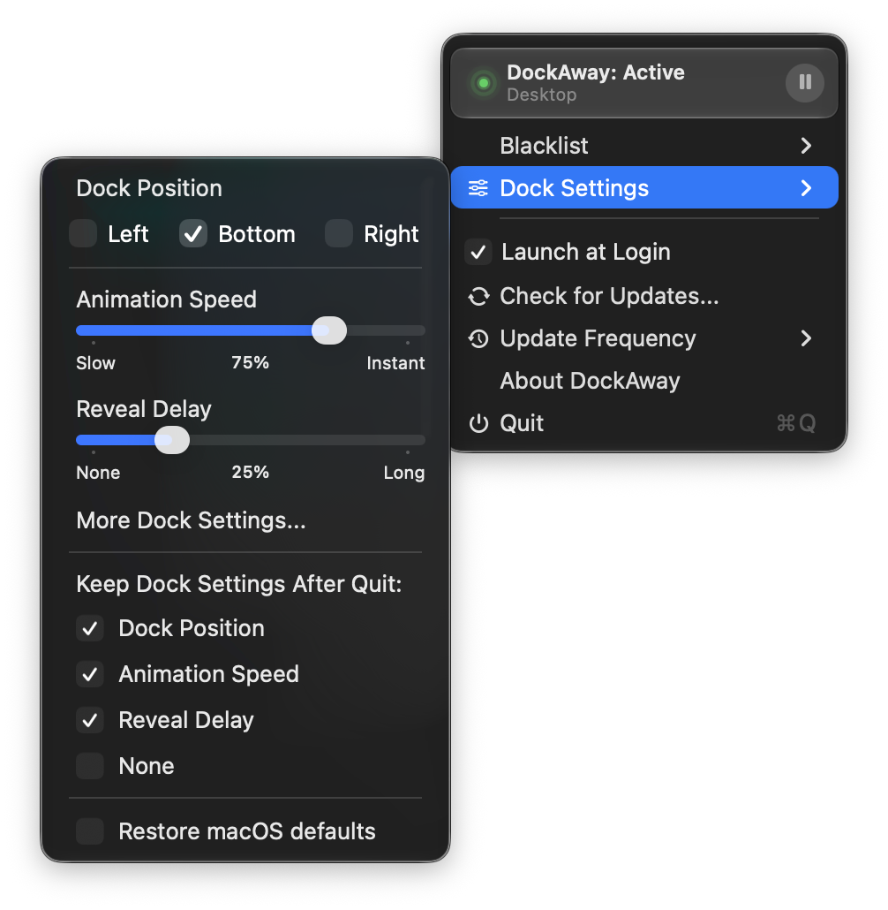

  

<h1 align="center">DockAway</h1>

A tiny macOS menu-bar utility that keeps your Dock out of the way. It shows the Dock on an empty desktop and normally hides it when an app window occupies the active display. Applications you add to the blacklist can keep the Dock shown while they are in front.

  

## When it's hidden and when it's shown

| What is on the active display? | DockAway's response |
| --- | --- |
| An empty desktop with no app windows | Dock shown |
| One or more app windows | Dock hidden |
| A blacklisted app is frontmost | Dock shown |
| A blacklisted app is visible, but a non-blacklisted app is in front | Dock hidden |
| The only or last window is minimized | Dock shown |
| One of multiple windows is minimized | Dock remains hidden |

DockAway uses the system shortcut **⌘⌥D** (Command+Option+D), the same shortcut you can press manually to toggle Dock auto-hide. Before acting, it checks the live Dock state to avoid unnecessary or duplicate toggles.

## Features

- A lightweight, native Swift menu-bar app.
- Official releases are signed with an Apple Developer ID and notarized by Apple.
- Works well alongside window-management apps such as Rectangle by Ryan Hanson and Swish by Christian Renninger.
- Responds to app switches, window changes, and Space or desktop swipes.
- Detects the desktop state on the display under your pointer, rather than just checking Finder. This correctly handles minimizing an app's last window, tiled/split-screen layouts, trackpad gesture minimizing, and multi-display setups.
- Verifies the live `com.apple.dock autohide` value before acting, reducing the chance of DockAway drifting out of sync with macOS.
- Uses accessibility events for immediate reactions and a lightweight safety check for apps that expose incomplete notifications.
- Caches running-process, bundle-identifier, and positive or negative blacklist results in memory. Cache entries are invalidated when apps launch or quit and when the blacklist changes.
- Adds native Dock Settings for position, animation speed, and reveal delay, complete with checkpoint snapping and haptic feedback.
- Lets you choose which Dock settings remain after quitting, or restore everything to the macOS defaults at any time.
- Includes a Launch at Login toggle directly in the menu, without a trip to System Settings.
- Restores the Dock to its normal visible state when DockAway quits.
- Updates the menu-bar Dock indicator from existing state events instead of running a separate cosmetic polling timer.
- Provides automatic updates and release notes through Sparkle.

## Menu bar

- **Status**: Shows the active app and whether DockAway is currently running. If a required permission is unavailable, the header displays **Permission Required** and identifies the missing access.
- **Stop / Resume**: Temporarily pauses DockAway and restores normal Dock visibility, then resumes monitoring from the same media-style control. When permission is missing, the resume button requests it and opens the appropriate System Settings page.
- **Blacklist**: Check running apps directly or choose installed apps from Finder so their windows do not hide the Dock.
- **Dock Settings**: Move the Dock to the left, bottom, or right; tune animation speed and reveal delay; choose which settings remain after quitting; or restore the macOS defaults.
- **Launch at Login Toggle**: Activates via `SMAppService`, with no System Settings round-trip needed.
- **Update Frequency**: Choose Daily, Every 3 Days, Weekly, or Manual Only. Sparkle remembers the selection, and manual update checks remain available with every option.
- **About DockAway**: Opens the standard macOS About panel.
- **Quit**: Resets Dock auto-hide to off and restores the Dock to its normal visible state.

## Application Blacklist

By default, every standard app window counts as an occupied display. Open **Blacklist** from DockAway's menu-bar menu and check any running app that should keep the Dock shown while it is in front. Use **Choose Application…** to select an app that is not currently open. Blacklisted apps remain listed with a checkmark and can be removed individually, or all at once with **Remove All**. When another app is brought in front of a blacklisted app, DockAway resumes its normal hiding behavior.

## Requirements

- **macOS 14 (Sonoma) or newer**
- **Accessibility permission**: Required because the app sends a synthetic ⌘⌥D keystroke via `CGEvent`. Granted under **System Settings → Privacy & Security → Accessibility**.
- **Input Monitoring permission**: A separate permission used by `MultitouchWatcher` to detect four fingers before macOS begins a workspace gesture. This early signal allows DockAway to pre-hide the Dock before a desktop swipe, reducing late Dock movement or window artifacts during landing. If either permission is unavailable, DockAway explains what is missing and provides a direct recovery button in its menu.

## Privacy

DockAway has no accounts, advertisements, analytics, or telemetry. Its window and gesture detection happens locally on your Mac, and that information is not uploaded by DockAway.

To do its job, DockAway detects running application names, process and bundle identifiers, window position and visibility metadata, Accessibility window events, the Dock's auto-hide preference, and raw trackpad contact positions used to recognize four-finger count and direction. It does not read window contents, document contents, or typed keyboard input, and it does not record or save trackpad gestures.

Your blacklist and basic app preferences are stored locally through macOS `UserDefaults`. Debug builds run from Xcode print diagnostic transition information to Xcode's console; those diagnostic messages are compiled out of release builds.

Sparkle is the only network-facing component. By default, it checks DockAway's appcast on GitHub Pages once every 24 hours, including after launch when the previous check is due. You can change that schedule to every three days, weekly, or manual-only from DockAway's menu. Updates are downloaded from GitHub Releases only when needed, and a manual **Check for Updates…** command remains available at any time. GitHub and its delivery infrastructure may receive normal connection information, such as your IP address, under their own privacy policies. DockAway does not send separate usage or tracking data with those requests.

## How the detection actually works

The core logic is distributed across `DockWatcher.swift`, `MultitouchWatcher.swift`, and `AppDelegate.swift`, combining event-driven accessibility notifications, window-list classification, and raw trackpad detection.

1. **Event-Driven Detection:** Per-app `AXObserver` notifications catch window creation, destruction, minimizing, restoring, moving, resizing, and focus changes. Workspace notifications cover app activation and Space changes.
2. **Source-Aware Trackpad Holds:** `MultitouchWatcher` reads raw trackpad contact positions before macOS recognizes a gesture. A sub-percent movement threshold distinguishes left, right, upward, and downward motion. On an empty source, DockAway takes a read-only snapshot of the neighboring Spaces while the fingers are still resting: a known occupied neighbor pre-hides at the first directional motion, while an empty or blacklisted neighbor keeps the Dock continuously visible. If that private Space information is unavailable, the existing short-lived on-screen destination probe takes over automatically. Upward Mission Control entry never sends HIDE.
3. **Mission Control Awareness:** DockAway watches Dock's accessibility hierarchy for Mission Control and uses a WindowServer signature as a fallback. While the overview or its landing animation is active, DockAway freezes its own visibility decisions and leaves the underlying auto-hide policy untouched. macOS can therefore present and dismiss its temporary Mission Control Dock natively, without changing an app window's landing geometry mid-animation. On a downward exit, the cached pre-overview desktop state chooses the landing hold: occupied apps remain hidden, while empty or blacklisted desktops keep the Dock continuously visible.
4. **Smart Window Detection:** `CGWindowListCopyWindowInfo` classifies the foremost normal app window on the display under the pointer. System overlays and tiny edge overlaps are ignored, and a covered blacklisted window cannot override the app in front of it.
5. **State Verification and Caching:** Before sending ⌘⌥D, DockAway checks the live `com.apple.dock autohide` value and tracks its most recent command to prevent overlapping events from issuing duplicate toggles. Process identities and both positive and negative blacklist results are cached in memory, then invalidated when the owning app or blacklist changes.
6. **Timings & Safety Nets:** Four-finger direction is recognized directly from trackpad frames; pointer-display and Mission Control state changes retain a lightweight 0.12-second check. The pointer timer has a small scheduling tolerance so macOS can combine nearby wakeups without changing its response interval. A 2-second full scan catches apps with incomplete accessibility support. Visible and hidden gesture holds release 0.60 seconds after finger lift, and Mission Control exit uses one 0.12-second verification tick before a fresh occupancy decision.
7. **Dynamic UI & Graceful Exits:** The menu-bar chevron is updated through DockAway's existing state events instead of a dedicated cosmetic timer. Monitoring stops while the Mac is asleep or locked, permission problems are surfaced in the menu, and quitting DockAway restores the Dock to its normal visible state.

## Signed and Notarized

Official DockAway releases are signed with an Apple Developer ID and notarized by Apple. This allows macOS to verify the developer, confirm the app has not been altered since it was signed, and validate the release through Gatekeeper. Releases downloaded from the official GitHub page should no longer require the previous **Open Anyway** workaround.

DockAway will still request Accessibility and Input Monitoring permission on first launch because those permissions are required for its Dock and trackpad features. Code signing and notarization do not bypass macOS privacy controls.

## Special Thanks

A special shout-out to [Rilmazafone](https://github.com/kageroumado/rilmazafone) and its developer [kageroumado](https://github.com/kageroumado). Rilmazafone creates DockAway's polished DMG and powers its release plan, including archiving, Developer ID signing, app and DMG notarization, stapling, verification, and release orchestration. It is a beautiful native Mac app backed by a great developer, and it made shipping DockAway dramatically better.

## Note

- If you use **Supercharge** by Sindre Sorhus, set **Delay before showing the Dock when hidden** to **None**. Its default 0.2-second delay can make the Dock appear slowly on empty desktops.
