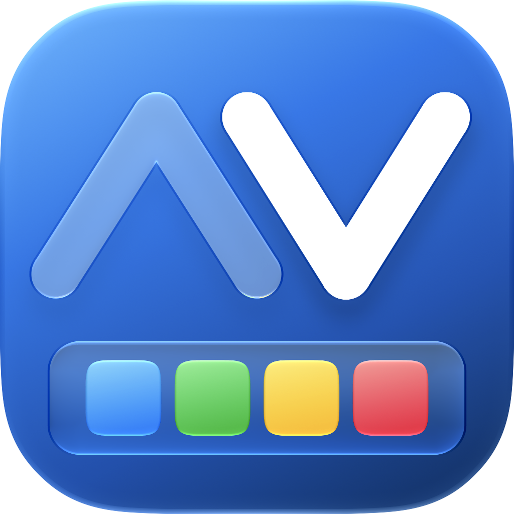

  

<h1 align="center">DockAway</h1>

A tiny macOS menu bar utility that keeps your Dock out of the way. It appears only when you're actually looking at an empty desktop and disappears the instant any app has a window on screen.

## When it's hidden and when it's shown
- Desktop is visible, no app window on screen | Dock Shown|
- Any app window is on screen |Dock Hidden|
- You minimize the only/last window on screen |Dock Shown|
- Two windows open, you minimize one |Dock Hidden|

It works by activating the system shortcut **⌘⌥D** (Command+Option+D), the same one you'd press manually to toggle Dock auto-hide, so it's never fighting macOS, just pressing the button for you at the right moments.

## Features

- A lightweight, Dynamic Menu bar app that's 100% Native, built with Swift.
- Works excellently with window management apps like "Rectangle" by Ryan Hanson or "Swish" by Christian Renninger (Highly Recommended, Incredible app.)
- Detects every app switch and every Space/desktop swipe in real time
- Detects the true desktop state system-wide rather than just checking Finder, so it correctly handles minimizing any app's last window, tiled/split-screen layouts, trackpad gesture minimizing, and so on
- Self-correcting: instead of trusting its own memory of "is the Dock shown?" it reads the live `com.apple.dock autohide` value before acting, so it can't quietly drift out of sync
- Features a safety check as a backstop, plus a check anchored to the exact moment of each Space change, so there's never a long window where it's silently wrong
- "Launch at Login" toggle built right into the menu, no detour through System Settings
- When quitting the app, it explicitly turns the Dock auto-hide setting off and shows the displays the dock which indicates the app has closed and that everything is back to normal. 
- Dynamic menu bar, Indicates dock status (Hidden or Shown) via up and down chevrons
- Automatic updates and changelogs via Sparkle

## Menu bar

- **Status**: Live text showing what triggered the last action
- **Launch at Login Toggle**: Activates via `SMAppService`, no System Settings round-trip needed
- **About DockAway**: The standard macOS about panel
- **Quit**: Also resets `autohide` to off and restarts the Dock. Quitting the app will bring the dock back up and visibly restore normal behavior

## Requirements

- **macOS 14 (Sonoma) or newer**
- **Accessibility permission**: Required because the app sends a synthetic ⌘⌥D keystroke via `CGEvent`. Granted under **System Settings → Privacy & Security → Accessibility**.
- I**nput monitoring permission (Activated automatically when granting Accessibility)**: Required to detect 4 fingers on the trackpad in order to hide the dock pre 4-finger swipe for smoothness via `MultitouchWatcher` . MacOS is quirky when it comes to hiding the dock mid-swipe, pre-hiding on a 4-fingers tap ensures a smooth swipe animation and prevents app artifacts and window bouncing.

## How the detection actually works

The core logic is distributed across `DockWatcher.swift`, `MultitouchWatcher.swift`, and `AppDelegate.swift`, combining window list scanning, raw trackpad detection, and system state polling.

1. **Event Triggers:** The app listens for `NSWorkspace.didActivateApplicationNotification` (app switches) and `NSWorkspace.activeSpaceDidChangeNotification` (Space/desktop swipes).
2. **Trackpad Pre-Hiding:** To ensure perfectly smooth swipe animations, a custom `MultitouchWatcher` hooks into the private MultitouchSupport framework to read raw trackpad contacts before macOS even recognizes a gesture. If it detects four fingers landing, it instantly pre-hides the Dock and "latches" this hidden state so subsequent checks do not accidentally show the Dock mid-swipe.
3. **Smart Window Detection:** When evaluating the screen, it checks the whole system via `CGWindowListCopyWindowInfo`. It looks for any normal-sized window on the standard layer (0) or elevated Mission Control layers (1 to 24). It explicitly ignores "Window Server", "Dock", and "DockAway" so it does not trigger a bounce on itself. Finding zero qualifying windows means you are on the desktop.
4. **State Verification:** Before sending the ⌘⌥D keystroke, it reads the live `com.apple.dock autohide` value directly from `UserDefaults`. It only fires if the actual state differs from the desired state, preventing the app from fighting itself or double-firing.
5. **Timings & Safety Nets:** Space changes trigger an immediate check, followed by a re-check 0.12 seconds later to allow the macOS window list to settle. A separate safety timer also runs continuously every 0.12 seconds to catch events that do not fire notifications, such as minimizing a window using a trackpad gesture.
6. **Dynamic UI & Graceful Exits:** A dedicated 0.25-second timer constantly updates the menu bar chevron (Up or Down) based on the Dock's actual visibility. If the app is quit naturally or force-closed via Activity Monitor, a `SIGTERM` Unix signal trapper catches the termination, resetting the Dock to its default visible state before completely exiting.

## Unsigned App Warning

Since I don't want to pay Apple $100 a year just for the pleasure of having my simple app "signed and notarized", You may get a pop-up saying " "DockAway" Not Opened ". In that case:
1. Click "Done" on the pop up
2. Go to System Settings> Privacy and Security and scroll all the way down
3. You'll see "DockAway was blocked to protect your mac", click "Open Anyway" 
4. Click "Open Anyway" again on the pop-up
5. Confirm with fingerprint/Password
6. Open DockAway again and grant accessibility permission. You're done! Enjoy your extra space.

## Note:
- If you have the **"Supercharge" app** by Sindre Horus, Please **set the "Delay before showing the Dock when hidden" option to "None"**. By default in the app, it is set to "0.2 seconds". Doing this prevents the annoying and slow 0.2s delay before the dock comes back up on empty desktops.
