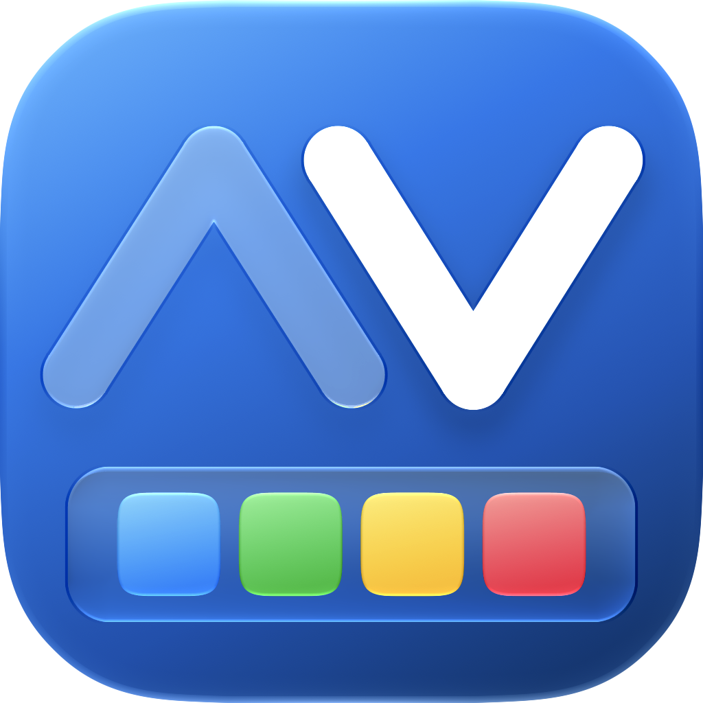
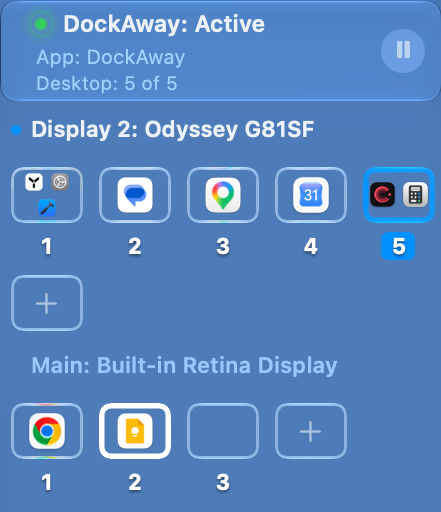

  

<h1 align="center">DockAway</h1>

A native macOS menu-bar utility that shows the Dock on empty desktops and hides it when an app occupies the active display. Keep it visible for selected apps with the blacklist, and manage your desktops without leaving the menu bar.

  <a href="https://github.com/akhairaddin/DockAway/releases/latest">Download</a> ·
  <a href="#features">Features</a> ·
  <a href="#desktop-manager">Desktop Manager</a> ·
  <a href="#first-launch-and-permissions">Setup</a> ·
  <a href="#privacy">Privacy</a> ·
  <a href="changelog.html">Changelog</a> ·
  <a href="https://github.com/akhairaddin/DockAway/issues">Support</a>

**DockAway 2.0** adds Desktop Manager, keyboard navigation, and optional window tools. See the [changelog](changelog.html) for the complete release notes.

## Features

- **Automatic Dock visibility:** Reacts to app switches, window changes, and desktop swipes on the display under your pointer. Predictive hiding helps the Dock get out of the way as you open an app.
- **Desktop indicators:** Customize desktop numbers in the menu bar and optionally show a brief desktop-change pop-up.
- **Window navigation:** Optional activate-on-hover, cursor teleportation between displays, and active-desktop placement for Finder and Chromium web apps.
- **Green Button Fills Window:** Bring a window forward and toggle between filling the available display area and its remembered size. Without a saved size, restore to a centered smaller window. Option-click enters fullscreen.
- **Mission Control Enhancements:** Optional automatic desktop-strip expansion and hovered-window actions for closing, minimizing, or quitting. Ability to use keyboard shortcuts to close or minimize apps.
- **Dock controls:** Adjust position, animation speed, reveal delay, and which settings persist after quitting. Optional Dock-icon actions minimize or hide windows and restore them on another click.
- **Extras and appearance:** Optional screenshot-to-clipboard copying, lock/unlock sounds, a mute-aware volume menu-bar icon, and Auto/Light/Dark themes.
- **Everyday essentials:** Pause/resume DockAway, Launch at Login, configurable automatic updates through Sparkle, Signed and Apple-Notarized official releases.

### Dock behavior and blacklist

An empty desktop or minimizing its last window shows the Dock. App windows hide it, unless a blacklisted app is frontmost. A blacklisted window behind another app does not keep the Dock visible.

Use **Blacklist → Choose Application…** for apps that aren't running. DockAway respects your system Dock-hiding shortcut, **Command+Option+D** by default, and checks the live Dock state before toggling it. Quitting restores normal Dock visibility.

## A Whole Desktop Manager, In Your Menubar.

  

See your desktops and their app icons, grouped by display. Switch to, create, close, drag desktops to reorder them or even move them between monitors. Fullscreen apps get their own named tiles, and the layout adapts to the number of desktops and apps. Incredible handy when you have 2+ Displays and you're juggling between desktops.

Open the menu with **Option+Up** or **Option+Shift+W**, then navigate with **arrow keys or WASD**. Right- and left-hand profiles have customizable select and close bindings. Closing while **+** is selected first moves the highlight back to a desktop; a second press closes it. Escape dismisses the menu.

## First launch and permissions

Requires **macOS 14 Sonoma or newer**. Guided setup walks you through **Accessibility** and checks **Input Access**, requesting Input Monitoring only when needed. Choose **Later** if macOS asks to quit during setup, then return to DockAway and select **Continue**. The app verifies access and restarts only if necessary.

If permissions are later revoked, DockAway pauses and shows **Permission Required**. Restore access and choose **Resume** to finish setup again. Signing and notarization do not bypass these permissions.

**Reveal delay:** On its first ready launch, DockAway removes any existing nonzero Dock reveal delay and briefly restarts the Dock. Later choices in **Dock Settings → Reveal Delay** are respected; another Dock utility can override them.

## Privacy

No accounts, ads, analytics, or telemetry. Window and gesture processing stays on your Mac. DockAway uses application identities, window metadata, Accessibility events, and trackpad contacts to manage the Dock and windows. Keyboard features handle configured shortcuts; DockAway does not keep a keystroke or gesture history. Preferences are stored locally. Optional screenshot copying places captured images on your clipboard while retaining their saved files.

Sparkle checks GitHub-hosted update information and downloads releases. GitHub may receive ordinary connection information such as your IP address. For manual-only checks, select **Manual Only** and disable **Check at Launch**.

How it works

Accessibility and workspace notifications drive window and desktop detection, backed by lightweight safety checks and cached application identities. Trackpad contacts allow early Dock hiding during desktop swipes. Mission Control transitions temporarily hold visibility decisions to avoid competing with macOS animations. Monitoring pauses during sleep and lock, and missing permissions stop monitoring safely. Some desktop and gesture capabilities depend on private macOS interfaces and can vary across OS versions or hardware.

## Special thanks

[Rilmazafone](https://github.com/kageroumado/rilmazafone), by [kageroumado](https://github.com/kageroumado), powers DockAway's DMG design and release workflow, including signing, notarization, and verification.
